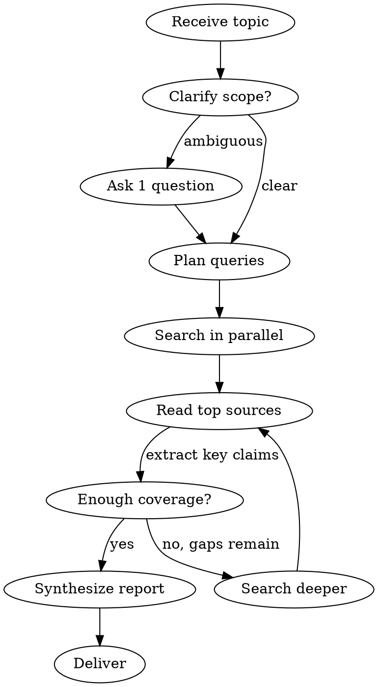

# Deep Web Research

Multi-source web research that produces structured reports with citations.

## Process



## Steps

1. **Scope** - Identify the core question. If ambiguous, ask one clarifying question.
2. **Plan queries** - Generate 3-5 diverse search queries covering different angles of the topic. Vary phrasing to maximize coverage.
3. **Search in parallel** - Run all queries using WebSearch. Dispatch parallel searches where possible.
4. **Read sources** - Use WebFetch on the most promising 3-6 results. Extract claims, data points, and quotes.
5. **Gap check** - Are there obvious angles not yet covered? If yes, run 1-2 more targeted searches.
6. **Synthesize** - Combine findings into a structured report.

## Output Format

```
# [Topic]

## Summary
[2-3 sentence overview of key findings]

## Key Findings
- [Finding 1 with context]
- [Finding 2 with context]
- [Finding 3 with context]

## Details
[Organized by subtopic. Include direct quotes where valuable. Note conflicting information.]

## Sources
- [Title](URL) - [one-line description of what it contributed]
- [Title](URL) - [one-line description]
```

## Rules

- Always include sources with URLs. No unsourced claims.
- Note when sources conflict rather than picking a side silently.
- Distinguish facts from opinions and speculation.
- If a topic is too broad, narrow it and state the scope chosen.
- Prefer recent sources. Note publication dates when relevance is time-sensitive.
- For technical topics, prioritize official docs and primary sources over blog posts.
- If WebFetch fails on a URL, note it and move on. Don't retry the same URL.
- Keep the report tight. Offer to expand specific sections if the user wants more depth.
